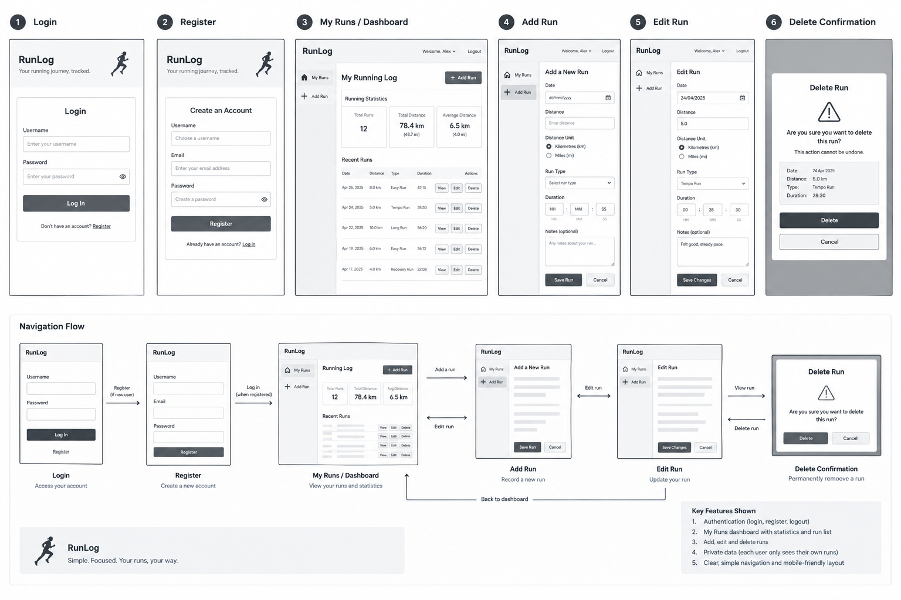
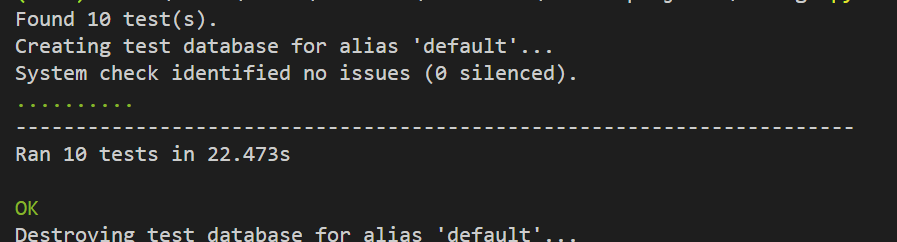
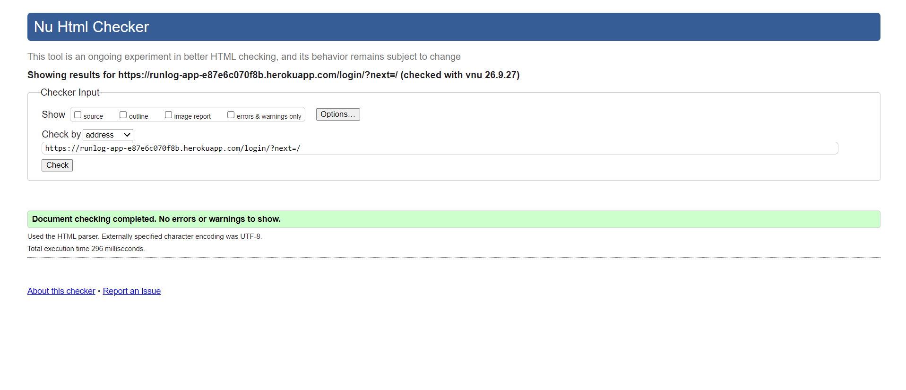
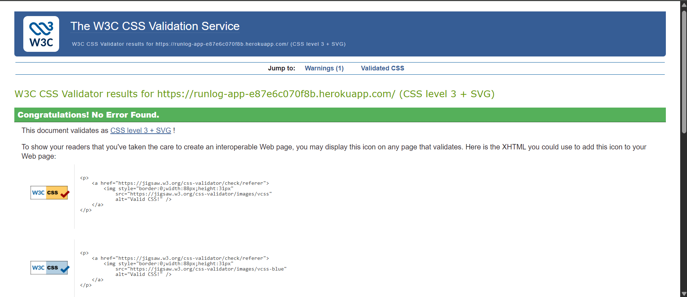
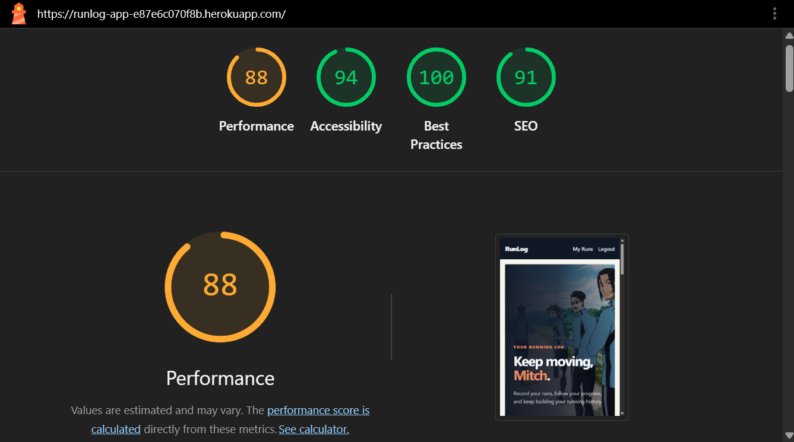
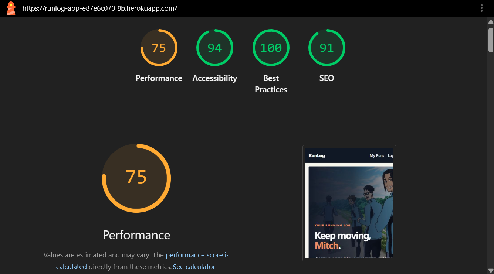

# RunLog

RunLog is a Django-based running log application that helps runners record, track, and review their running activity over time.

## Live Website

[RunLog App on Heroku](https://runlog-app-e87e6c070f8b.herokuapp.com/)

## Project Overview

RunLog was created as a full-stack web application for runners who want a simple and private way to manage their training history.

Users can register for an account, log in securely, add running sessions, and review their past activity. Each run can include distance, duration, distance unit, run type, and notes. The app also provides basic running statistics to support progress tracking.

### Core Goals

- Secure registration and authentication
- Personal running history tracking
- CRUD functionality for user records
- Privacy between different user accounts
- Clear statistics and feedback
- Responsive, accessible user experience

---

## User Experience

The application is designed to be straightforward and easy to use for runners at any experience level.

### User Journey

1. Register for an account.
2. Log in.
3. Add a running activity.
4. View running history.
5. Edit or delete past runs.
6. Review running statistics.
7. Log out when finished.

The interface uses clear navigation, readable forms, and a running-focused visual style inspired by anime and sport culture while remaining practical and user-friendly.

### User Stories

#### Authentication

1. As a runner, I want to register for an account so that I can securely access my running records.
2. As a registered user, I want to log in and log out so that I can access my account safely.

#### Run Management

3. As a runner, I want to add a run so that I can record my training.
4. As a runner, I want to view my runs so that I can review my running history.
5. As a runner, I want to edit my runs so that I can correct or update details.
6. As a runner, I want to delete my runs so that I can remove records I no longer need.

#### Statistics and Privacy

7. As a runner, I want to see my running statistics so that I can monitor my progress.
8. As a runner, I want my runs to be private so that other users cannot access or modify my data.

### Wireframes

Initial wireframes were created during planning to define the main layout and the user journey before implementation.



---

## Features

### User Registration and Authentication

Users can create an account through the registration page and securely log in to access their personal running records.

### Run Tracking

Logged-in users can add a new running record with:

- Distance
- Distance unit
- Duration
- Run type
- Notes

### Run History

Users can view, edit, and delete their own runs from their personal history.

### Statistics

The application calculates running statistics based on the user's stored activity.

### Notifications

Feedback messages are displayed after actions such as:

- Logging in
- Logging out
- Creating a run
- Editing a run
- Deleting a run

### Responsive Design

The application is designed to work across desktop and mobile screen sizes.

---

## Technologies Used

### Languages

- HTML5
- CSS3
- Python

### Frameworks and Libraries

- Django
- Gunicorn
- WhiteNoise

### Database

- PostgreSQL in production
- SQLite for local development

### Development Tools

- Visual Studio Code
- Git
- GitHub
- Google Chrome Developer Tools

### Deployment

- Heroku

### Validation and Testing Tools

- Django automated tests
- W3C HTML Validator
- W3C CSS Validator
- Google Lighthouse

---

## Database and Security

RunLog uses Django's ORM to manage persistent application data. User and running activity records are stored in the database, and each user's records are associated with their authenticated account so that access is restricted to their own data.

### Security Considerations

- Django authentication is used for account access and protected pages.
- User queries are filtered by the authenticated user.
- Sensitive production configuration is stored in environment variables rather than hard-coded into the source.

Environment variables used include:

- `SECRET_KEY`
- `DATABASE_URL`
- `DEBUG`
- `ALLOWED_HOSTS`
- `CSRF_TRUSTED_ORIGINS`

Production settings are separated from local development settings, and the deployed app uses `DEBUG=False`.

---

## Agile Development

Development was planned and tracked using GitHub Projects, with the application broken into user stories and tasks to support an incremental build process.

### GitHub Project Board

- **Project Board:** [RunLog GitHub Project](https://github.com/users/m-ejere/projects/5)

### MoSCoW Prioritisation

The project requirements were prioritised using the MoSCoW method.

#### Must Have

- User registration
- User login
- User logout
- Add a run
- View running history
- Edit runs
- Delete runs
- Private user records

#### Should Have

- Running statistics
- User feedback notifications
- Distance unit selection
- Run type selection
- Notes for running records

#### Could Have

- More detailed statistics
- Additional visual improvements
- Extra running features

#### Won't Have

Features outside the core purpose of the application were intentionally left out to maintain a clear project focus.

---

# Testing

Testing was carried out throughout development to verify that the application met the core requirements.

## Manual Testing

The main user journeys were manually tested as a normal user.

| Feature | Action | Expected Result | Result |
|---|---|---|---|
| Register | Enter valid registration details and submit the form | A new account is created and confirmation is displayed | Pass |
| Login | Enter valid login credentials | The user is successfully logged in | Pass |
| Logout | Select the logout option | The user is logged out and confirmation is displayed | Pass |
| Add Run | Enter valid run details and submit the form | The run is saved and appears in running history | Pass |
| View Runs | Open running history | The user's saved runs are displayed | Pass |
| Edit Run | Select an existing run and change its details | The updated information is saved and displayed | Pass |
| Delete Run | Select the delete option for a run | The selected run is removed | Pass |
| Statistics | Open the statistics section | Running statistics are displayed | Pass |
| Distance Units | Select a distance unit | The selected unit is used correctly | Pass |
| Run Type | Select a run type when adding a run | The selected run type is saved | Pass |
| Notes | Add notes to a run | The notes are saved with the run | Pass |
| Restricted Pages | Attempt to access protected functionality while logged out | Access is restricted | Pass |
| User Privacy | Use a different user account | Users cannot access another user's runs | Pass |
| Navigation | Use navigation links throughout the application | Links open the correct pages | Pass |
| Responsive Layout | Use the application at desktop and mobile widths | The layout remains usable and readable | Pass |
| Form Validation | Submit forms with invalid or missing information | Appropriate validation feedback is displayed | Pass |
| Notifications | Complete create, edit, and delete actions | A confirmation message is displayed | Pass |

## Automated Testing

Django automated tests were used to validate key application functionality.

The project includes automated tests and the test suite passed successfully.



## HTML Validation

The deployed website was checked using the W3C Markup Validation Service.



## CSS Validation

The project's CSS was tested using the W3C CSS Validation Service.



## Lighthouse Testing

Google Lighthouse was used to evaluate the app for performance, accessibility, best practices, and SEO.

Testing was carried out at both desktop and mobile sizes.

### Desktop



### Mobile



## Testing Evidence

| Test | Evidence |
|---|---|
| Django automated tests | `evidence/automated-tests.png` |
| HTML validation | `evidence/html-validation.png` |
| CSS validation | `evidence/css-validation.png` |
| Lighthouse desktop | `evidence/lighthouse-desktop.png` |
| Lighthouse mobile | `evidence/lighthouse-mobile.png` |
| Wireframes | `evidence/wireframes.png` |

---

# Deployment

RunLog was deployed to Heroku.

## Deployment Process

The application was prepared for deployment by:

1. Creating a production-ready Django configuration.
2. Adding PostgreSQL for the production database.
3. Adding Gunicorn as the web server.
4. Adding WhiteNoise for static file handling.
5. Creating a `Procfile`.
6. Configuring Heroku environment variables.
7. Running Django migrations.
8. Running `collectstatic`.
9. Pushing the application to GitHub.
10. Deploying the application to Heroku.

## Heroku Configuration

The following production configuration variables were used:

- `SECRET_KEY`
- `DEBUG`
- `ALLOWED_HOSTS`
- `CSRF_TRUSTED_ORIGINS`
- `DATABASE_URL`

## Procfile

The application uses the following process configuration:

```text
web: gunicorn runlog.wsgi
release: python manage.py migrate --noinput
```

## Live Application

The deployed application can be accessed at:  
[https://runlog-app-e87e6c070f8b.herokuapp.com/](https://runlog-app-e87e6c070f8b.herokuapp.com/)

---

# Usage

## Registering an Account

1. Open the RunLog website.
2. Select the registration option.
3. Enter the required account information.
4. Submit the registration form.
5. Log in using the new account.

## Adding a Run

1. Log in to the application.
2. Open the option to add a run.
3. Enter the distance.
4. Select the distance unit.
5. Enter the duration.
6. Select the run type.
7. Add optional notes.
8. Submit the form.

## Managing Runs

From the running history, users can:

- View their runs
- Edit existing runs
- Delete runs

## Viewing Statistics

Users can access the statistics section to review information calculated from their recorded runs.

---

# AI Usage

AI tools were used as a development support resource during the project.

They were used for tasks including:

- Debugging development issues
- Understanding Django errors
- Reviewing and improving code
- Supporting automated testing
- Troubleshooting deployment issues
- Planning the application structure
- Improving documentation
- Assisting with wireframe planning

AI-generated suggestions were reviewed, tested, and adapted during development rather than being used without verification.

---

# Credits

## Frameworks and Resources

- **Django**: Main Python web framework
- **PostgreSQL**: Production database
- **Gunicorn**: Production web server
- **WhiteNoise**: Static file handling
- **GitHub**: Version control and project management
- **Heroku**: Deployment platform
- **Google Lighthouse**: Performance, accessibility, best-practice, and SEO testing
- **W3C Validation Tools**: HTML and CSS validation

## Visual Assets

The application uses custom project imagery, including the RunLog logo and running-related visuals.

---

# Future Development

The current project focuses on the core requirements of a personal running log.

Potential future improvements include:

- More detailed statistics
- Running progress charts
- Personal goals
- Additional run categories
- Improved filtering and sorting
- Additional profile functionality

These features were intentionally left outside the scope of the current project.

---

# Conclusion

RunLog provides runners with a simple and private way to record, manage, and review their running activity.

The application demonstrates a full-stack Django project with authentication, database management, CRUD functionality, responsive design, automated testing, and deployment to production.